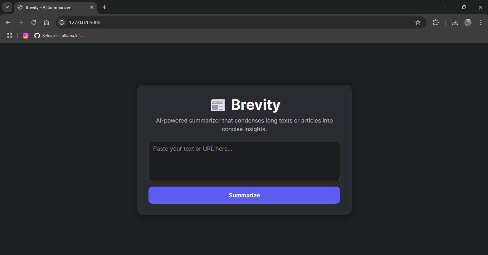
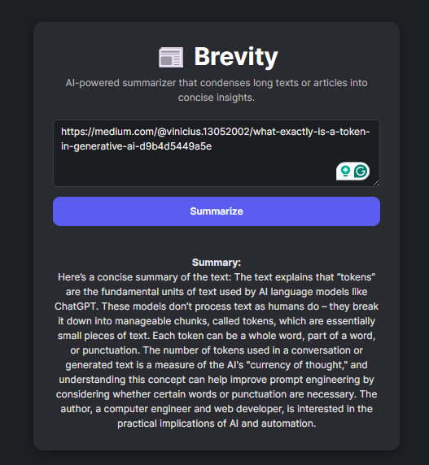

# Brevity 📰✨

Brevity is a simple **AI-powered article summarizer**.  
Paste a URL or some text, and it instantly gives you a **clear, concise summary**.  

---

## 🚀 Features

✅ Summarizes long articles into a few sentences  
✅ Works with **URLs or plain text**  
✅ Clean and minimal UI  
✅ Powered by **Ollama**  
✅ Mobile-friendly  

---

## 🖼️ Preview

<!-- Add a screenshot or GIF of the app -->


---

## 🛠️ Tech Stack

- **Frontend:** Jinja2 + Bootstrap  
- **Backend:** Flask
- **AI:** Ollama (model used for tests gemma3:1b)  

---

## 📦 Installation

Clone the repo and install dependencies:

```bash
git clone https://github.com/Vini1305/brevity.git
cd brevity
python -m venv venv
source venv/bin/activate   # On Linux/Mac
# OR
venv\Scripts\activate      # On Windows

pip install -r requirements.txt
````

Create a `.env` file with your API key:

```env
OLLAMA_MODEL=your-model-here(standard gemma3:1b)
FLASK_ENV=development
```

Run the development server:

```bash
flask --app brevity run
```

Then open http://localhost:5000 in your browser.

---

## 💡 How It Works

1. User enters a URL or text
2. The app fetches the article content (if a URL is given)
3. Sends the text to the **Ollama local server** with a summarization prompt
4. Displays a **concise summary**

<!-- Add a small diagram or flow image here -->



---

## 💡 Why Ollama?
Brevity uses Ollama as its AI engine because it’s completely free, lightweight, and runs entirely on your machine. Unlike cloud-based APIs (which often require API keys and have usage costs), Ollama allows you to run powerful open-source models locally with zero cost and no data leaving your device.

For this project, we use gemma3:1b, a small yet efficient model ideal for text summarization. This makes Brevity easy to run anywhere—no subscriptions, no hidden fees, just a simple local setup.

## 🔑 Environment Variables

| Variable         | Description         |
| ---------------- | ------------------- |
| `OLLAMA_MODEL`   |      Your model     |
| `FLASK_ENV`      | Your Flask Env here |

---

## 🤝 Contributing

Pull requests are welcome!
If you’d like to suggest features, open an issue.

---

## 📄 License

This project is licensed under the MIT License.

---

## 👨‍💻 Author

**Vinícius de Paula**

* [LinkedIn](www.linkedin.com/in/vinícius-de-paula-5076991b0)
* [Medium](https://medium.com/@vinicius.13052002)
